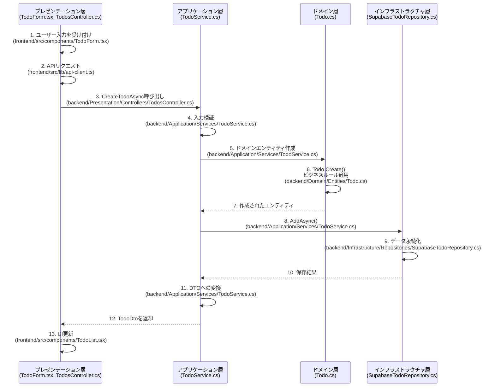
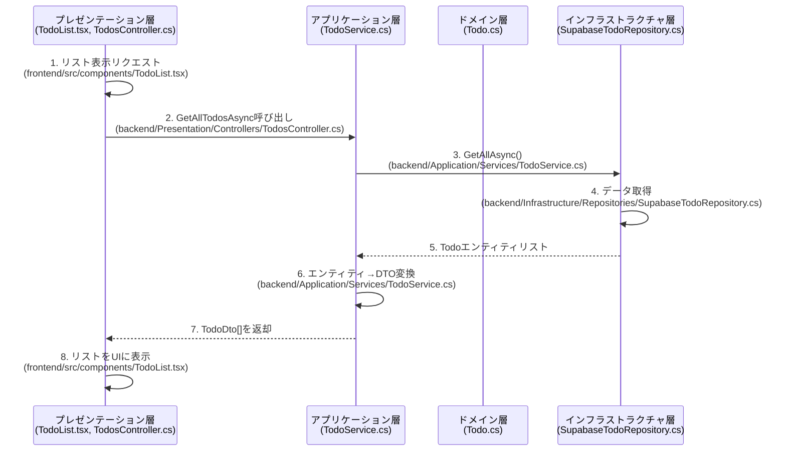
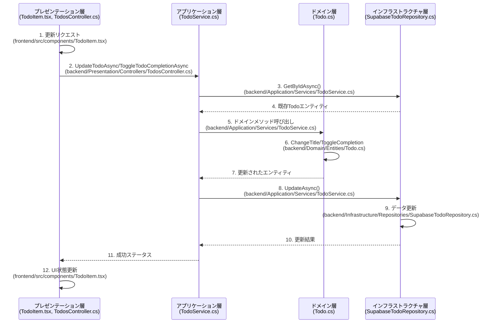
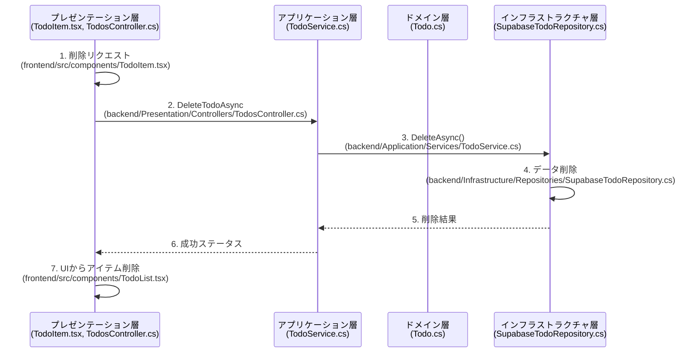

# CSharp Todo アプリケーション

C#と React を使用したシンプルな Todo アプリケーションです。DDD アーキテクチャと Typescript を採用した初学者向けの学習プロジェクトです。

## 技術スタック

### フロントエンド

-   React (Next.js)
-   TypeScript
-   shadcn/ui (UI コンポーネント)
-   Tailwind CSS (スタイリング)
-   ESLint (コード品質)

### バックエンド

-   C# (.NET 9)
-   ドメイン駆動設計 (DDD)
-   ASP.NET Web API

### データベース

-   Supabase (PostgreSQL)

### デプロイ

-   Vercel

## 機能

-   Todo アイテムの作成、読み取り、更新、削除（CRUD 操作）
-   Todo アイテムの完了/未完了の切り替え
-   レスポンシブデザイン

## プロジェクト構成

### フロントエンド (`/frontend`)

```
frontend/
├── src/
│   ├── app/              - Nextページ
│   ├── components/       - Reactコンポーネント
│   │   ├── ui/           - shadcn/uiコンポーネント
│   │   ├── TodoForm.tsx  - Todo追加用フォーム
│   │   ├── TodoItem.tsx  - 個々のTodoアイテム
│   │   └── TodoList.tsx  - Todoリスト
│   └── lib/
│       └── api-client.ts  - バックエンドAPI通信
```

### バックエンド (`/backend`)

```
backend/
├── Domain/               - ドメイン層
│   ├── Entities/         - エンティティクラス
│   └── Repositories/     - リポジトリインターフェース
├── Application/          - アプリケーション層
│   ├── DTOs/             - データ転送オブジェクト
│   └── Services/         - アプリケーションサービス
├── Infrastructure/       - インフラストラクチャ層
│   └── Repositories/     - リポジトリ実装
└── Presentation/         - プレゼンテーション層
    └── Controllers/      - API コントローラー
```

## ドメイン駆動設計（DDD）の実装

このアプリケーションは、ドメイン駆動設計（DDD）の原則に基づいて構築されています。以下に主要なコンポーネントと実装の詳細を示します：

### ドメイン層

1. **Todo エンティティ**:

    - ID、タイトル、完了フラグ、作成日時、ユーザー ID の属性を持つ
    - プライベートセッターでカプセル化を実現し、不変性を保証
    - ファクトリメソッド `Create()` で新しい Todo を作成
    - タイトル変更、完了/未完了の設定、完了トグルなどのドメインロジックを実装

2. **ITodoRepository インターフェース**:
    - データアクセスの抽象化を提供（永続化の詳細からドメインを分離）
    - `GetAllAsync()`: すべての Todo を取得
    - `GetByIdAsync()`: 特定 ID の Todo を取得
    - `AddAsync()`: 新しい Todo を追加
    - `UpdateAsync()`: 既存 Todo を更新
    - `DeleteAsync()`: Todo を削除

### アプリケーション層

1. **DTO オブジェクト**:

    - `TodoDto`: 表示用の完全な Todo 情報
    - `CreateTodoDto`: 新規作成時に必要な情報
    - `UpdateTodoDto`: 更新時に使用する情報（部分更新可能）

2. **TodoService**:
    - リポジトリを注入し、アプリケーションロジックを実装
    - ドメインエンティティと DTO の相互変換
    - 入力検証とビジネスルールの適用
    - 各操作の実装：
        - `GetAllTodosAsync()`: すべての Todo を DTO に変換して返却
        - `GetTodoByIdAsync()`: ID 指定で Todo を検索、存在確認
        - `CreateTodoAsync()`: 入力検証後、Todo エンティティを作成
        - `UpdateTodoAsync()`: ID 検証と部分更新の実施
        - `DeleteTodoAsync()`: ID での削除と存在確認
        - `ToggleTodoCompletionAsync()`: Todo の完了状態を切り替え

### アーキテクチャ特徴

-   **クリーンアーキテクチャ**の原則に従った設計
-   **依存性の注入**を活用した疎結合設計
-   **境界づけられたコンテキスト**によるドメインの分離
-   **DTO パターン**によるレイヤー間のデータ転送
-   **非同期処理**によるパフォーマンス最適化

この構造により、テスト容易性、保守性、拡張性を持つ堅牢なアプリケーションが実現されています。ドメインロジックとインフラストラクチャの分離が明確で、ビジネスルールの表現が優れています。

## DDD アーキテクチャに基づく CRUD 操作のデータフロー図

各 CRUD 操作におけるデータの流れを、DDD の各レイヤーを中心とした視点でのデータフロー図を以下に示します。これにより、DDD アーキテクチャでのデータのライフサイクルと各レイヤーの責任範囲が明確になります。

### 新規 Todo の作成（Create）- DDD 視点



### Todo リストの取得（Read）- DDD 視点



### Todo の更新（Update）- DDD 視点



### Todo の削除（Delete）- DDD 視点



### DDD レイヤー別の責任

1. **プレゼンテーション層**

    - ユーザーインターフェースとの対話
    - API リクエスト/レスポンスの処理
    - データの表示フォーマット
    - **ファイル**: `TodosController.cs`, フロントエンドコンポーネント

2. **アプリケーション層**

    - ユースケースのオーケストレーション
    - 入力検証とビジネスルールの適用
    - トランザクション管理
    - ドメインオブジェクトと DTO の変換
    - **ファイル**: `TodoService.cs`, DTO クラス

3. **ドメイン層**

    - ビジネスロジックの中核
    - エンティティとその振る舞い
    - 不変条件の実装
    - 値オブジェクト
    - **ファイル**: `Todo.cs`エンティティ

4. **インフラストラクチャ層**
    - データアクセス
    - 外部サービス連携
    - 永続化
    - キャッシュなどの技術的関心事
    - **ファイル**: `SupabaseTodoRepository.cs`

### レイヤー間の依存関係

-   ドメイン層は他のどのレイヤーにも依存しない（内側レイヤー）
-   アプリケーション層はドメイン層に依存する
-   プレゼンテーション層はアプリケーション層とドメイン層に依存する
-   インフラストラクチャ層はアプリケーション層とドメイン層に依存する（依存性逆転の原則）

## セットアップ手順

### 前提条件

-   .NET 9 SDK
-   Node.js 16 以上
-   npm または yarn
-   Supabase アカウント

### Supabase 環境の設定

1. **Supabase アカウント登録**:

    - [Supabase 公式サイト](https://supabase.com)でアカウントを作成
    - 新規プロジェクト作成
    - プロジェクト URL、API Key（anon key）をメモしておく

2. **Supabase 接続情報を設定**:

    - `backend/appsettings.Development.local.json`ファイルを作成（gitignore に含めること）

    ```json
    {
        "Supabase": {
            "Url": "your_supabase_url_here",
            "Key": "your_supabase_anon_key_here"
        }
    }
    ```

3. **Supabase データベースの設定**:

    - テーブルエディタで`todos`テーブルを以下のスキーマで作成：
        - `id`: uuid 型、PRIMARY KEY、デフォルト値: `gen_random_uuid()`
        - `title`: text 型、NOT NULL
        - `is_completed`: boolean 型、デフォルト値: false
        - `created_at`: timestamptz 型、デフォルト値: `now()`
        - `user_id`: uuid 型（NULL 許容、外部キー、認証機能を実装する場合）

4. **テーブルの権限設定**:

    - Authentication > Policies に移動
    - `todos`テーブルの RLS（Row Level Security）を有効にする
    - 以下のポリシーを追加：

        ```sql
        -- すべてのユーザーに読み取り権限を付与
        CREATE POLICY "Enable read access for all users"
        ON "public"."todos"
        FOR SELECT USING (true);

        -- すべてのユーザーに追加権限を付与
        CREATE POLICY "Enable insert access for all users"
        ON "public"."todos"
        FOR INSERT WITH CHECK (true);

        -- すべてのユーザーに更新権限を付与
        CREATE POLICY "Enable update access for all users"
        ON "public"."todos"
        FOR UPDATE USING (true);

        -- すべてのユーザーに削除権限を付与
        CREATE POLICY "Enable delete access for all users"
        ON "public"."todos"
        FOR DELETE USING (true);
        ```

### バックエンドのセットアップ

1. プロジェクトルートに移動：

    ```bash
    cd backend
    ```

2. 必要なパッケージをインストール：

    ```bash
    dotnet restore
    ```

3. バックエンドを起動：
    ```bash
    dotnet run
    ```
    サーバーが http://localhost:5078 で起動します

### フロントエンドのセットアップ

1. フロントエンドディレクトリに移動：

    ```bash
    cd frontend
    ```

2. 必要なパッケージをインストール：

    ```bash
    npm install
    ```

3. API クライアントの設定：

    - `src/lib/api-client.ts`を開き、API のベース URL がバックエンドの URL と一致することを確認：
        ```typescript
        const API_BASE_URL = "http://localhost:5078/api";
        ```

4. 開発サーバーを起動：
    ```bash
    npm run dev
    ```
    フロントエンドが http://localhost:3000 で起動します

### 動作確認

1. ブラウザで http://localhost:3000 にアクセス
2. Todo の追加、編集、削除、完了状態の切り替えが正常に動作することを確認

## 学習リソース

-   [C# 公式ドキュメント](https://learn.microsoft.com/ja-jp/dotnet/csharp/)
-   [ASP.NET Core ドキュメント](https://learn.microsoft.com/ja-jp/aspnet/core/)
-   [React 公式ドキュメント](https://ja.react.dev/)
-   [TypeScript 公式ドキュメント](https://www.typescriptlang.org/ja/)
-   [ドメイン駆動設計リファレンス](https://www.amazon.co.jp/dp/B00UX9VJGW/)
-   [Supabase ドキュメント](https://supabase.com/docs)

## ライセンス

MIT ライセンス
